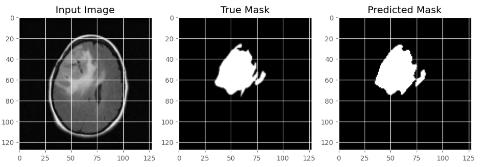

# 🧠 Brain Tumor Segmentation using MRI & U-Net

A deep learning project for **automatic brain tumor segmentation** from MRI scans using the **U-Net** architecture.  
Developed as part of my **Final Year Project (PFE)** in Biomedical Engineering, this work integrates **medical imaging**, **AI**, and **healthcare innovation**.

---

## 🚀 Overview

Accurate segmentation of brain tumors from MRI scans is essential for diagnosis, treatment planning, and follow-up in **neuro-oncology**.  
This project implements a **U-Net convolutional neural network**, trained and fine-tuned on public MRI datasets (e.g., BRATS), achieving high accuracy in detecting tumor regions.  

An **interactive Streamlit app** is also provided, allowing real-time testing of the model.

---

## 📌 Highlights

- **Architecture**: U-Net optimized for medical image segmentation.
- **Performance**: High Dice similarity score for precise tumor boundary detection.
- **Preprocessing**: Image normalization, resizing, and augmentation.
- **Fine-tuning**: Model trained and refined for better generalization.
- **Deployment**: Streamlit-based web app for quick demos.
- **External Model Storage**: Pre-trained weights hosted on Google Drive.

---

## 📊 Results
|                        Metric                                                             |                                                   Score    |
|-------------------------------------------------------------------------------------------|------------------------------------------------------------|
|                        Dice Score                                                         |                                                   0.92     |
|                          IoU                                                              |                                                   0.88     |

**Example outputs:**

  

