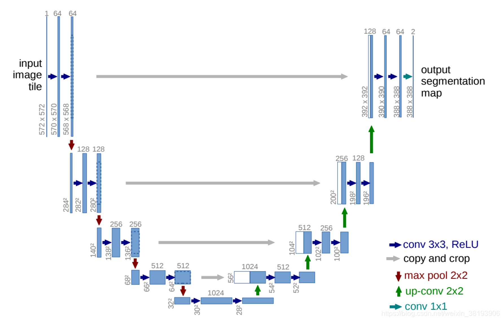

# 🧠 Deep Learning-Based Automated Brain Tumor Segmentation from MRI Images Using a U-Net Convolutional Neural Network

A deep learning project for automatic brain tumor segmentation from **MRI scans** using **the U-Net architecture**.
Developed as part of my Final Year Project (PFE) in **Biomedical Engineering**, this work integrates **medical imaging**, **artificial intelligence**, and **healthcare innovation**.

---

🚀 Overview

Accurate segmentation of brain tumors from MRI scans is essential for **diagnosis**, **treatment planning**, and follow-up in **neuro-oncology**.
This project implements a U-Net convolutional neural network, trained on public MRI datasets and fine-tuned using clinical MRI data from **the Oncology and Hematology Center of the Mohammed VI University Hospital in Marrakech**.

An interactive Streamlit application called **NeuroSeg** is provided, enabling real-time testing and visualization of the model’s segmentation results.

---

## 📚 Dataset

The model was trained using the **LGG MRI Segmentation Dataset** provided by [Mateusz Buda on Kaggle](https://www.kaggle.com/datasets/mateuszbuda/lgg-mri-segmentation).  
This dataset comprises 110 cases of lower-grade glioma (LGG) patients, including MRI scans with manual segmentation masks for FLAIR abnormalities.  
The dataset was sourced from The Cancer Imaging Archive (TCIA) and is publicly available for research purposes.

In addition, the model was fine-tuned on clinical MRI data from the Oncology and Hematology Center of the Mohammed VI University Hospital in Marrakech.

⚠️ The hospital data is private and cannot be shared publicly.

Number of images: 196 MRI scans

Number of masks: 196 corresponding segmentation masks

Number of patients: 10

Tumor type: Glioblastoma

This combination of public and clinical data improves model performance and ensures that the system generalizes well to real-world cases.

---

## 📌 Unet_Architecture

  

---

## 📊 Results

| Metric       | Score |
|--------------|-------|
| Dice Score   | 0.8443  |
| Loss          | 0.557  |
**Example outputs:**

  
 

## 🔮 Future Work

1. Explore advanced models: Test newer and more powerful segmentation architectures (e.g., attention U-Nets, Transformers) to improve accuracy.

2. 3D MRI analysis: Extend the model to work with 3D volumes, enabling volumetric tumor segmentation for better clinical insights.

3. Clinical validation: Evaluate the model on larger and more diverse patient cohorts.

4. Integration: Explore integration with hospital systems for real-time clinical use.

## 📖 References

1. Deep Learning for Brain Tumor Segmentation: Advances and Challenges (ScienceDirect, 2024)  
URL: https://www.sciencedirect.com/science/article/pii/S2405959524001115

2. Brain Tumor Segmentation with Deep Neural Networks (IEEE Xplore, 2019)  
URL: https://ieeexplore.ieee.org/document/8964956

3. Brain Tumor Segmentation using Convolutional Neural Networks in MRI Images (IEEE Xplore, 2018)  
URL: https://ieeexplore.ieee.org/document/8987265

